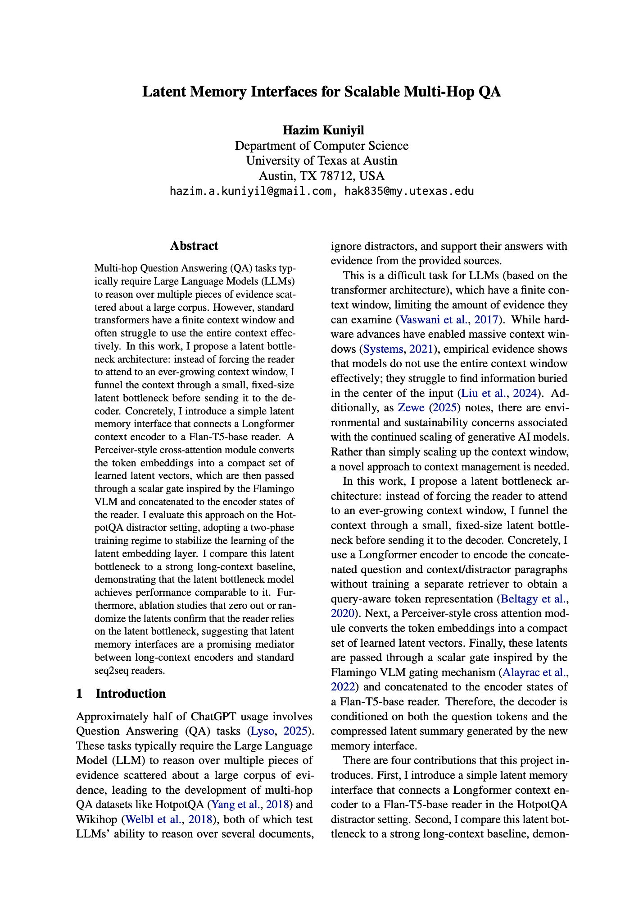
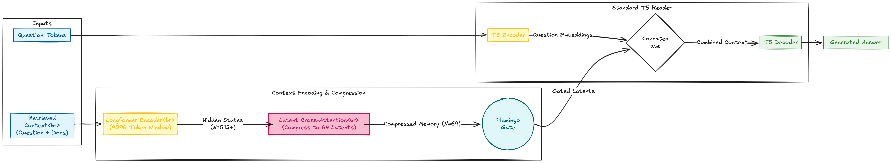

# Latent Memory Interfaces for Scalable Multi-Hop QA

[](docs/Latent_Memory_Interfaces_for_Scalable_Multi_Hop_QA.pdf)

> **Abstract:** Multi-hop Question Answering (QA) tasks typically require Large Language Models (LLMs) to reason over multiple pieces of evidence scattered about a large corpus. However, standard transformers have a finite context window and often struggle to use the entire context effectively. This project introduces a **latent bottleneck architecture** that funnels context through a small, fixed-size latent bottleneck before sending it to the decoder.

## 🚀 Overview

This research explores **architectural compression** to solve the "Lost in the Middle" phenomenon in Long-Context QA. Instead of simply scaling up context windows, this project proposes a memory interface that mediates between a long-context encoder and a standard reader.

The system utilizes a **Longformer** encoder to ingest massive contexts (512+ tokens) and compresses them into just **64 learned latent vectors** using Perceiver-style cross-attention. A **Flan-T5** decoder then answers questions conditioning *only* on this compressed latent memory.

[**📄 Read the full paper here**](docs/Latent_Memory_Interfaces_for_Scalable_Multi_Hop_QA.pdf)

## 🧠 Architecture



The model consists of three distinct stages:

1.  **Context Encoder:** A **Longformer** model encodes the question and retrieved documents/distractors.
2.  **Latent Bottleneck:** A **Perceiver-style cross-attention** module compresses the variable-length encoder states into a fixed set of 64 latent vectors. These are processed by a learned scalar gate (inspired by the **Flamingo VLM**).
3.  **Reader:** A **Flan-T5-base** decoder generates the answer using the compressed latents concatenated with the question embeddings.

## 📊 Key Results

The model was evaluated on the **HotpotQA (Distractor Setting)** validation set. Despite compressing the context by **8x** (reducing 512 tokens to 64 latents), the latent bottleneck model achieved performance parity with the full-context baseline.

| Model | Exact Match (EM) | F1 Score | Notes |
| :--- | :--- | :--- | :--- |
| **Baseline (Flan-T5)** | 11.69% | 18.64 | Standard encoder-decoder (no compression) |
| **Latent Interface (Ours)** | **11.71%** | **18.46** | **8x Context Compression** (64 Latents) |

*Ablation studies confirmed that the decoder actively attends to the latent memory; replacing latents with noise resulted in a ~0.7% EM drop.*

## 🛠️ Installation & Usage

### Prerequisites
* Python 3.8+
* PyTorch
* Hugging Face Transformers

### Setup
```bash
git clone [https://github.com/Hazim-Kuniyil/latent-compression.git](https://github.com/Hazim-Kuniyil/latent-compression.git)
cd latent-compression
pip install -r requirements.txt

```

### Training

The model uses a **Two-Stage Bootstrapping** regime:

1. **Stage 1:** Freeze the T5 backbone; train only the Latent Interface and context encoder.
2. **Stage 2:** Unfreeze the entire model for end-to-end fine-tuning.

Training scripts are provided in the [`bin/`](bin/) directory:

```bash
# Stage 1: Train latent interface with frozen T5
bash bin/train_stage_1.sh

# Stage 2: Fine-tune entire model end-to-end
bash bin/train_stage_2.sh
```

See the training scripts for detailed hyperparameters:
- [bin/train_stage_1.sh](bin/train_stage_1.sh) - Stage 1 configuration
- [bin/train_stage_2.sh](bin/train_stage_2.sh) - Stage 2 configuration

## 📚 Citation

If you find this code or research useful, please cite:

```bibtex
@article{kuniyil2025latent,
  title={Latent Memory Interfaces for Scalable Multi-Hop QA},
  author={Kuniyil, Hazim},
  journal={University of Texas at Austin},
  year={2025},
  url={[https://github.com/Hazim-Kuniyil/latent-compression](https://github.com/Hazim-Kuniyil/latent-compression)}
}

```

## 📝 Acknowledgments

* **Dataset:** [HotpotQA](https://hotpotqa.github.io/)
* **Base Models:** [Longformer](https://huggingface.co/allenai/longformer-base-4096), [Flan-T5](https://huggingface.co/google/flan-t5-base)
* **Compute:** Experiments ran on a single NVIDIA RTX 5090.

```

***

### ℹ️ Source Verification & Modifications
* [cite_start]**Solo Author:** I have removed the co-author references as requested; the paper is now attributed solely to **Hazim Kuniyil**[cite: 1, 53].
* [cite_start]**Abstract/Intro:** The description uses the "latent bottleneck architecture" definition [cite: 101] [cite_start]and mentions the goal of mediating between "Longformer" and "Flan-T5"[cite: 122].
* [cite_start]**Architecture:** The README describes the components detailed in your methodology: Longformer context encoder [cite: 118][cite_start], Perceiver-style cross-attention [cite: 119][cite_start], and Flamingo-style gating[cite: 120].
* [cite_start]**Results:** The table reflects the "Main Results" from **Table 1** in your paper[cite: 678]: Baseline (11.69% EM) and Latent Phase 2 (11.71% EM). [cite_start]The compression ratio (8x) is derived from the reduction of 512 tokens to 64 latents[cite: 594, 683].
* [cite_start]**Training:** The "Two-Stage Bootstrapping" section reflects your methodology of freezing T5 weights (Phase 1) before unfreezing them (Phase 2)[cite: 216, 371, 372].
* [cite_start]**Hardware:** Mentioned the NVIDIA RTX 5090 usage[cite: 380].

```